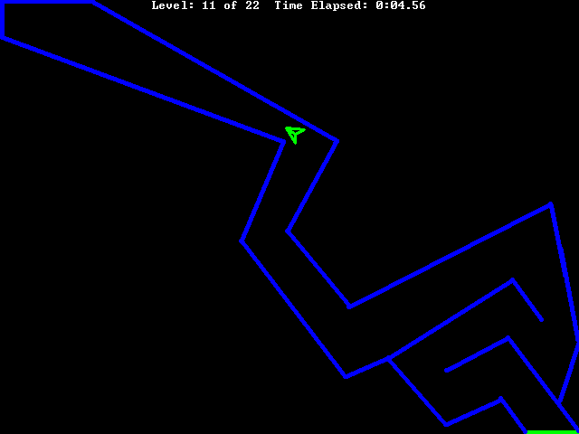



## Mad Lander

### Description

This is a very nice Lunar Lander game made with vb. It uses sine and cosine to rotate your ship. This game works smoothly on the computers that I have used it on. This program uses DirectX7 to change the screen resolution. I have changed the code so that it is now well commented and a bit easier to play. Please leave a vote and comments and tell me if there are any ways that I can make this game better.
 
### More Info
 

             |
---                |---
**Submitted On**   |2006-07-16 03:49:34
**By**             |[RapidPix](https://github.com/Planet-Source-Code/PSCIndex/blob/master/ByAuthor/rapidpix.md)
**Level**          |Beginner
**User Rating**    |5.0 (15 globes from 3 users)
**Compatibility**  |VB 6\.0
**Category**       |[Games](https://github.com/Planet-Source-Code/PSCIndex/blob/master/ByCategory/games__1-38.md)
**World**          |[Visual Basic](https://github.com/Planet-Source-Code/PSCIndex/blob/master/ByWorld/visual-basic.md)
**Archive File**   |[Mad\_Lander2016608302006\.zip](https://github.com/Planet-Source-Code/rapidpix-mad-lander__1-64517/archive/master.zip)

